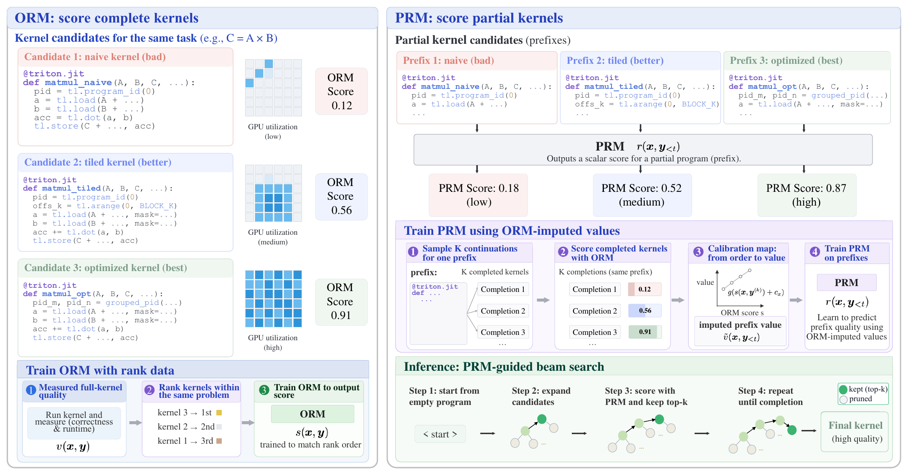

# ProcessKernel: Calibrated Process Supervision for GPU Kernel Generation

An execution-free process supervision framework that turns one-time outcome measurements
into reusable guidance for unfinished GPU kernels during autoregressive generation.

[KernelBench](https://github.com/ScalingIntelligence/KernelBench) |
[KernelBook dataset](https://huggingface.co/datasets/GPUMODE/KernelBook) |
[License](LICENSE)



## 👋 Overview

Generating efficient GPU kernels requires searching a vast space of functionally equivalent
programs whose performance depends on low-level hardware behavior. Effective search relies on
execution feedback, but obtaining it is expensive: each candidate must be completed,
compiled, validated and timed. ProcessKernel amortizes a much smaller set of measured
executions into scalable process supervision:

1. **Outcome reward model (ORM).** We train an ORM on complete kernels with measured
   correctness-and-speed grades. It learns within-problem rankings, which avoids regressing
   absolute values that vary substantially across problems.
2. **Calibration.** ORM scores are ordinal, not calibrated values. We map them to terminal
   grades with a small set of executed anchor kernels: one monotone map shared by all
   problems, plus a per-problem offset.
3. **Process reward model (PRM).** The calibrated ORM estimates the value of many sampled
   continuations of a partial kernel without executing them. This turns sparse terminal
   measurements into dense supervision for a PRM over unfinished generations.
4. **Guided search.** At inference time, the PRM guides a segment-level beam search, and the
   ORM selects the final kernel from the candidate pool. Neither stage executes a kernel.

The PRM works independently of the generator and needs no retraining or modification of it.

In the paper, this reduces process-supervision labeling cost by 76× (9.3 vs. an estimated
707 H100 GPU-hours), while improving generated-kernel correctness by up to 38% and achieving
up to 21.64× speedup.

## ⚙️ Pipeline

| Stage | Command | Code in `src/processkernel/` |
|---|---|---|
| Convert KernelBook into KernelBench problems | `pk stage-kernelbook` | `generation/kernelbook/` |
| Generate kernels with per-token traces | `pk generate --trace` | `generation/` |
| Grade compilation, correctness and runtime | KernelBench's `eval_from_generations.py` | [grader patch](kernelbench.patch) |
| Train the ORM as a within-problem ranker | `pk train-orm` | `orm/` |
| Impute prefix values: continuations, ORM scores, calibration | `pk build-prm` … `pk lists` | `prm/data/`, `prm/rollout/` |
| Train the PRM on the imputed values | `pk train-prm` | `prm/train/` |
| Guided search: PRM-guided beam search, ORM picks the final kernel | `pk search` | `prm/search/` |

`pk` lists every command, and `pk <command> --help` shows its options. The training,
labeling and search stages read one YAML each from [`configs/`](configs); any value can be
overridden after `--config` as `section.key=value`.

## 🔍 Pattern linter

`pk lint` reads a kernel file without running it. It parses the file into a syntax tree and
builds a model of the module: the Triton kernels it defines, the launch sites in its host
code and the buffers each launch reads and writes. Its 13 checks are rules over this model,
in three families:

- **Family 1:** work left to PyTorch or not done, e.g. no Triton kernel, a kernel that is
  never launched, or a kernel output that never reaches the result.
- **Family 2:** memory passes and launches added by host code. Triton never fuses separate
  launches, so a tensor that one launch writes and another reads makes a full round trip
  through device memory.
- **Family 3:** structure of the kernel body, e.g. processing one element at a time or
  looping over runtime bounds.

A file shows a pattern when its check matches at least once; the checks record patterns, not
a verdict on a kernel's quality. A separate gate (S1) checks that the grader can load the
file at all. The linter needs no GPU and is not part of generation or search.

## 📚 Datasets

- **Evaluation: KernelBench** levels 1 and 2 (`--level N`, read from Hugging Face; levels 3
  and 4 work the same way).
- **Training: KernelBook, deduplicated.** `pk stage-kernelbook` converts each PyTorch module
  into a KernelBench problem and scales its placeholder `4` shapes up. Byte-identical
  problems are then merged, keeping the lowest problem id. The resulting 13,371 problems are
  staged as KernelBench level 7:

  ```bash
  pk generate --model <hf-id> --dataset kernelbook --level 7 \
      --ref-dir KernelBench/KernelBench/level7 --all --num-samples 4 --trace
  ```

  The PRM build drops 62 more problems whose baseline timing is ambiguous or whose
  reference does nothing ([list](configs/prm_exclude_level7.json)), which leaves 13,309.

Always pass `--ref-dir` for KernelBook. Without it, the model is prompted with the unscaled
4×4 placeholder shapes but graded on the scaled ones.

## 📁 Directory structure

```
src/processkernel/
├── cli.py                the `pk` command
├── config.py             every stage's config: dataclasses, YAML loading, overrides
├── generation/           `pk generate`: prompts, vLLM backend, traces;
│                         kernelbook/ stages KernelBook as a KernelBench level
├── checker/              pattern linter: check families F1-F3, submission gate S1
├── orm/                  ORM: encoding, model, listwise training; data/ builds the dataset
└── prm/
    ├── data/             labels from the generation runs: cut points, targets, splits
    ├── rollout/          rollouts, ORM scores, calibration, values, lists
    ├── train/            PRM training and the ranking check
    └── search/           segment-level beam search and report
configs/                  one YAML per stage
tests/                    mirrors src/processkernel/
kernelbench.patch         our patch to the pinned KernelBench commit
```

`KernelBench/` (the grader checkout), `runs/` (generated kernels) and `data/` (datasets and
checkpoints) are created at run time and git-ignored.

## 🔧 Set up

```bash
uv sync      # Python 3.12; the dev, gen (vLLM) and train groups are on by default

# The grader: KernelBench at the pinned commit plus our patch, in its own environment
git clone https://github.com/ScalingIntelligence/KernelBench.git && cd KernelBench
git checkout 423217d && git apply ../kernelbench.patch
uv sync && cd ..   # Python 3.10, as KernelBench requires
```

The grader is KernelBench at `423217d` plus [`kernelbench.patch`](kernelbench.patch):

- `src/kernelbench/timing.py` casts only floating-point inputs to the eval precision; index
  and mask tensors keep their dtype.
- `scripts/generate_baseline_time.py` times the baselines at the eval precision (fp32), eager
  or `torch.compile`.
- `src/kernelbench/eval.py` grades multi-output problems on their primary output
  (`scripts/kb_normalize.py`); `INDUCTOR_GRID_COMPAT=1` restores the inductor `grid` helper
  that torch 2.10+ dropped.
- `scripts/eval_from_generations.py` records a transient compile error as a failure instead
  of crashing the run.
- `pyproject.toml` installs torch from the CUDA 12.8 index.

Always grade with `uv run` inside `KernelBench/`: our environment has an unpatched
`kernelbench` package that only builds the prompt. Generation, search, training and grading
need NVIDIA GPUs on Linux; the linter and the tests run on CPU.

## 🚀 Usage

```bash
# No GPU: print the paper's prompt for one level-1 problem
pk generate --model x --level 1 --problems 0 --dry-run

# Generate 4 kernels per problem, then grade them
pk generate --model <hf-id> --level 1 --all --num-samples 4 --trace
cd KernelBench && uv run python scripts/eval_from_generations.py run_name=<run> \
    runs_dir=<abs path of runs/> dataset_src=local level=1 backend=triton \
    gpu_arch='["Hopper"]' num_samples_per_problem=4 && cd ..

# Check one kernel, or a whole run folder
pk lint check runs/<run>/level_1_problem_23_sample_0_kernel.py
pk lint scan runs/<run> --out linter_findings.jsonl --workers 32

# Reward models and search
pk train-orm  --config configs/orm.yaml
pk build-prm  --config configs/prm_build.yaml     # then split-prm, prefixes ... lists
pk train-prm  --config configs/prm_train.yaml     # multi-GPU launch: see the config
pk search     --config configs/prm_search.yaml
```

A run folder holds the kernels, the run's arguments and, with `--trace`, the token ids and
top-20 alternatives at every step, which the PRM trains on. The PRM's training runs added
two prompt blocks (`--prompt-deltas contract,precision`) and were written as `shard_*`
folders (`--output-dir runs/<run>/shard_00`), the layout `pk build-prm` reads.

## 🧪 Tests

```bash
uv run pytest                      # no GPU needed; GPU and grader tests skip
uv run pytest --cov --cov-branch   # coverage floor: 95%
```

A known, unfixed bug is a strict-xfail test. A fixed bug keeps a regression test that
failed on the unfixed code.

## 🪪 License

MIT, see [LICENSE](LICENSE). The grader is
[KernelBench](https://github.com/ScalingIntelligence/KernelBench) (MIT) with
[our patch](kernelbench.patch).
